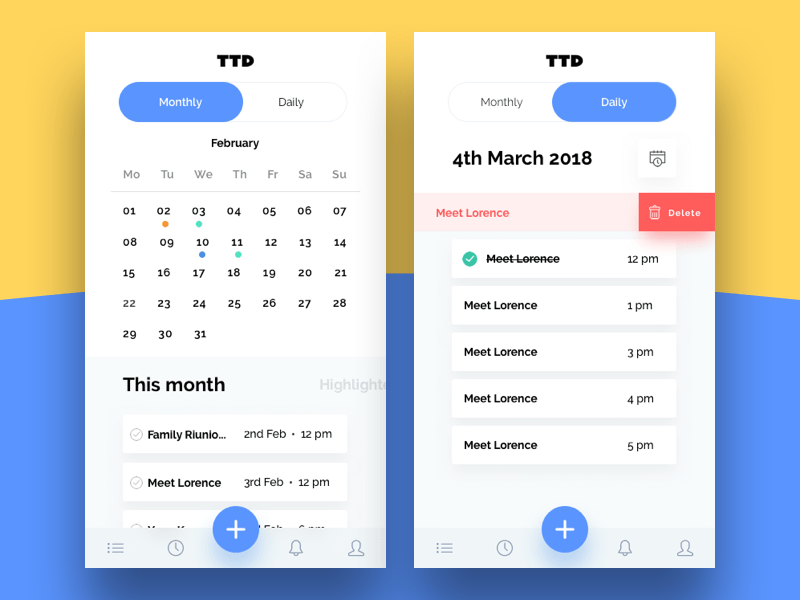
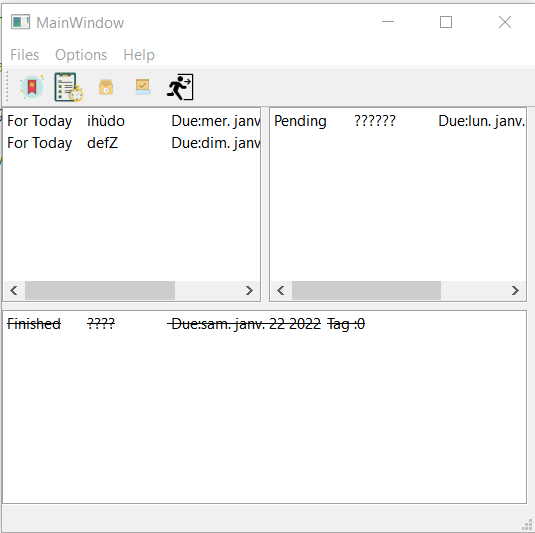

<div id="top"></div>


<!-- PROJECT LOGO -->
<br />
<div align="center">
    
  
</div>


<!-- TABLE OF CONTENTS -->
<details>
  <summary>Table of Contents</summary>
  <ol>
        <li><a href="#introduction">Introduction</a></li>
        <li><a href="#features">Features</a></li>
        <li><a href="#To-Do-header">To Do Header</a></li>
        <li><a href="#To-Do-cpp">To Do Cpp</a></li>
        <li><a href="#forms">Forms</a></li>
  </ol>
</details>

- # [Introduction](#Introduction)
 Everyone has things to do, and we all seem to need help getting them done.To Do Application help you to  manage your tasks and store an archive of all the pending and finished tasks.

- # [Features](#Features)
This application makes you comfortable, you can start each day with peace of mind by clearly visualizing the tasks in progress. also it gives you the opportunity to focus on what matters and save all your ideas to do in the future.
##  **In our Application we have :**

 -Menu Bar.
 
 -Tool bar.
 
 -Another window where you put your tasks .
 
 
## **the application looks like that :**
<p align="center">
     
   </p>

  - ## [To Do Header](#To-Do-Header)
    - ### [ MainWindow header](#MainWindow-header)
    - ### [ AddDiaolg header](#AddDiaolg-header)
   
   # To Do Header
## MainWindow header
 ### Functions
```c++

class MainWindow : public QMainWindow
{
    Q_OBJECT

public:
    MainWindow(QWidget *parent = nullptr);
    ~MainWindow();
    void makeConnexions();
    void chargerTasks(QString myFile);
    }
```
 ### Private Slots
 ```c++
private slots:

    void on_actionAdd_Task_triggered();

    void on_actionTask_Done_triggered();

    void on_actionPending_Task_triggered();

    void on_actionClose_triggered();

    void on_actionabout_Qt_triggered();

    void on_actionabout_triggered();

private:
    Ui::MainWindow *ui;
    
```
## AddDiaolg header
  ### Functions
```c++
class addDialog : public QDialog
{

    Q_OBJECT

public:
    explicit addDialog(QWidget *parent = nullptr);
    ~addDialog();

    QString getDescription();
    QString getTag();
    QString getFinished();
    QDate getDueDate();
    void showEvent(QShowEvent * event);


private:
    Ui::addDialog *ui;

};

```

  - ## [To Do Cpp](#To-Do-Cpp)
    - ### [ MainWindow Cpp](#MainWindow-Cpp)
          -####  Make connexions
          -####  New Task
          -####  ChargerTasks
          -####  Tasks done
          -####  Pending Tasks
          -####  Close
          -####  About Qt
          -####  About
    - ### [ AddDiaolg Cpp](#AddDiaolg-Cpp)
    - ### [ Main Cpp](#Main-Cpp)
        
# To Do Cpp
 ##   MainWindow Cpp
     
 #### Make connexions
 ```c++ 

void MainWindow::makeConnexions(){

    connect(ui->actionAdd_Task,&QAction::triggered,this,&MainWindow::on_actionAdd_Task_triggered);
    connect(ui->actionClose,&QAction::triggered,this,&MainWindow::close);
    connect(ui->actionTask_Done,&QAction::triggered,this,&MainWindow::on_actionTask_Done_triggered);
    connect(ui->actionPending_Task,&QAction::triggered,this,&MainWindow::on_actionPending_Task_triggered);

}

 ```
#### New Task
Here we connect the window with dialog and we connect them with all actions
 ```c++ 
void MainWindow::on_actionAdd_Task_triggered()
{
  
   addDialog D ;
   D.setModal(false);
   D.exec();
//    D = new addDialog(this);
//    D->show();
    QString newTask ;

    // Get the line edit text
    QString description = D.getDescription();
    if (description!=NULL){

        QString finished = D.getFinished();//Get Finished bool
        QDate curDate = D.getDueDate();// Get current date
        newTask = description +"\t Due:"+ curDate.toString() ;
        QString Tag= D.getTag();
          if(Tag == "Work")
            Tag="0";
          else if (Tag == "Life")
            Tag="1";
          else
            Tag="2";
          if (finished=="finished" || curDate < QDate::currentDate()){
             newTask = "Finished\t"+newTask+"\tTag :"+Tag+"\n";
              ui->Finished->addItem(newTask);}

          else if (curDate == QDate::currentDate()){
              newTask = "For Today\t"+newTask+"\tTag :"+Tag+"\n";
                ui->taskForToday->addItem(newTask);}
         else{
                 newTask = "Pending\t"+newTask+"\tTag :"+Tag+"\n";
                ui->pendingTask->addItem(new QListWidgetItem(QIcon(":/new/prefix1/icons8-add-property-96.png"),newTask));
             }
                             }
   QString fichier = "myFile.txt";
   QFile file(fichier); // Appel du constructeur de la classe QFile

    if (file.open(QIODevice::Append | QIODevice::Text)) {
    // Si l'ouverture du fichier en écriture à réussie
    // écrire dans le fichier en utilisant un flux :
    QTextStream out(&file);
    out << newTask;

    // Fermer le fichier
    file.close();
    }

}
 ``` 
 #### ChargerTasks
   Here we add file where we charge Tasks 
  ```c++ 
void MainWindow::chargerTasks(QString myFile){
    QFile fichier(myFile);

    if(fichier.open(QIODevice::ReadOnly | QIODevice::Text)) // ReadOnly on lecture // ::Text si le fichier est deja ouvert
    {
        QTextStream flux(&fichier);
        while(!flux.atEnd())
        {
            QString temp = flux.readLine();
            if(  temp.startsWith("Finished"))
            ui->Finished->addItem(temp);
            else if( temp.startsWith("Pending"))
                    ui->pendingTask->addItem(temp);
            else
                    ui->taskForToday->addItem(temp);
        }
        fichier.close();
    }
}
 ``` 
 #### Tasks done
  ```c++ 
void MainWindow::on_actionTask_Done_triggered()
{
    QString widget = ui->pendingTask->currentItem()->text();

    ui->Finished->addItem(widget);
    QListWidgetItem *remWidget = ui->pendingTask->currentItem();
    delete remWidget;
}
 ```
 #### Pending Tasks
  ```c++ 
void MainWindow::on_actionPending_Task_triggered()
{
    QString widget = ui->Finished->currentItem()->text();

    ui->pendingTask->addItem(widget);
    QListWidgetItem *remWidget = ui->Finished->currentItem();
    delete remWidget;
}
 ```
 #### Close
  ```c++ 
void MainWindow::on_actionClose_triggered()
{
    auto reply = QMessageBox::question(this, "Exit",
                     "Do you really want to quit?");
    if(reply == QMessageBox::Yes)
        qApp->exit();
}
 ```
 #### About Qt
  ```c++ 
void MainWindow::on_actionabout_Qt_triggered()
{
   QApplication::aboutQt();
}

 ```
 #### About:
  ```c++ 
void MainWindow::on_actionabout_triggered()
{
    QMessageBox::information(this,"about Application","the goal of this application is manage you tasks.");
}

```
 ##  AddDiaolg Cpp
 in this code we find the connexion of  every slot we had in such as date ,description , and other functions.
 ```c++
addDialog::addDialog(QWidget *parent) :
    QDialog(parent),
    ui(new Ui::addDialog)
{
    ui->setupUi(this);
}
void addDialog::showEvent(QShowEvent * event)
{
    QDate date = QDate::currentDate();
    ui->dateEdit->setDate(date); // sets the current date to date edit.

    QDialog::showEvent(event);
}

QString addDialog::getDescription(){
    return ui->description->text();

}
QString addDialog::getFinished(){
    if (ui->checkBox->isChecked())
       return "finished";
    else
        return "pending";
}
QString addDialog::getTag(){

    return ui->comboBox->currentText();


}
QDate addDialog::getDueDate(){

    return ui->dateEdit->date();

}
```
##  Main Cpp
 ```c++
int main(int argc, char *argv[])
{
    QApplication a(argc, argv);
    MainWindow w;
    w.chargerTasks("myFile.txt");
    w.show();
    return a.exec();
}

```


 - ## [Forms](#forms)
    - ### [ MainWindow ui](#MainWindow-ui)
    - ### [ AddDiaolg ui](#AddDiaolg-ui)
       
        
# Forms
 ##   MainWindow ui
 
<!-- PROJECT LOGO -->
<br />
<div align="center">
    
  
</div>

 ##  AddDiaolg ui
 
 <!-- PROJECT LOGO -->
<br />
<div align="center">
    
  
</div>


Our Team -[DARBAL nour-elhouda](https://github.com/teamkhaoulanour) -[MZOUDI Khaoula](https://github.com/KhaoulaMzoudi)

Project Link: [To Do](https://https://github.com/Darbal-Nour-elhouda/To-Do/new/main)

Encadré par : [Mr.Belcaid Anass](https://)


<p align="right">(<a href="#top">back to top</a>)</p>
